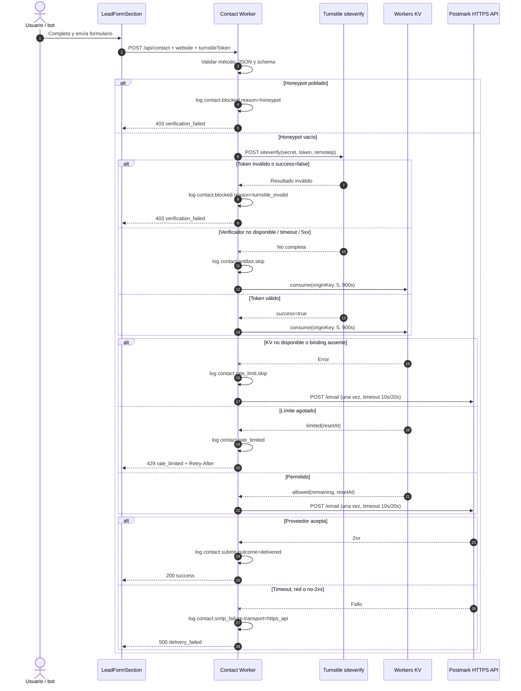

# Diseño: protección del formulario de contacto contra abuso y spam (NEX-48)

## 1. Contexto y objetivos de diseño

Este cambio migra `POST /api/contact` desde el handler Express-style actual a un módulo ES de Cloudflare Workers y añade, en este orden, honeypot, verificación Turnstile, rate limiting compartido en Workers KV y entrega de correo acotada. El diseño conserva las decisiones funcionales confirmadas: no usa cookies, limita a 5 intentos cada 15 minutos por IP normalizada, degrada de forma fail-open ante fallos de Turnstile o KV, no reintenta el correo dentro del request y nunca devuelve detalles internos del proveedor.

Objetivos técnicos:

- usar solamente APIs compatibles con Workers en el camino de ejecución;
- separar verificación anti-bot, rate limiting y entrega de correo mediante contratos sustituibles;
- permitir desactivar Turnstile y rate limiting de manera independiente por configuración;
- mantener respuestas estables y genéricas para el cliente;
- producir logs JSON útiles para comparar spam, intentos aceptados y entregas fallidas sin registrar contenido del lead;
- hacer explícita la limitación de consistencia de Workers KV.

No se modifica el comportamiento de GSAP ni Lenis. Los cambios visuales se limitan al formulario, reservando espacio para Turnstile para evitar layout shift.

## 2. Decisión de entrega: API HTTPS en lugar de Nodemailer

### 2.1 Alternativas consideradas

| Alternativa | Ventajas | Riesgos y costes |
|---|---|---|
| A. Nodemailer con `nodejs_compat` | Conserva SMTP, las variables actuales y los timeouts `connectionTimeout`, `greetingTimeout` y `socketTimeout` de forma literal. | Nodemailer depende de `net`/`tls` y otras APIs Node cuyo soporte en Workers es parcial; obliga a habilitar compatibilidad Node, aumenta el bundle y mantiene el riesgo de incompatibilidad en runtime o después de una actualización. Requiere una prueba de socket real contra el proveedor para considerar seguro cada despliegue. |
| B. API HTTPS del proveedor mediante `fetch` | Usa la primitiva nativa y mejor soportada de Workers, evita sockets TCP y `nodejs_compat`, simplifica abortar la operación y reduce la superficie de dependencias. | Cambia credenciales SMTP por una API key y acopla un adaptador al contrato HTTP de un proveedor. Los timeouts ya no corresponden literalmente a fases SMTP. |

### 2.2 Decisión

Se elige **B: API HTTPS de Postmark mediante `fetch`**, encapsulada tras `EmailDelivery`. Postmark se usa como implementación inicial porque ofrece una API transaccional HTTPS simple, acepta HTML y no requiere SDK Node. El endpoint del proveedor queda fijado en código (`https://api.postmarkapp.com/email`) para no convertir una variable de entorno en un destino de red arbitrario. Un cambio futuro de proveedor solo reemplaza el adaptador.

No se habilita `nodejs_compat` y se eliminan Nodemailer, `@types/nodemailer` y la utilidad SMTP sin uso. Esta decisión evita basar un flujo crítico en compatibilidad parcial de `net`/`tls`.

Los valores confirmados de timeout se preservan por intención, adaptados al transporte HTTPS:

- máximo aproximado de **10 s hasta recibir headers** del proveedor, equivalente al límite de establecimiento/saludo;
- máximo aproximado de **20 s para la operación completa**, incluida la lectura de respuesta;
- **cero reintentos** dentro del request.

La implementación usa un único `AbortController`: un temporizador aborta si `fetch` no entrega headers en 10 s; al recibirlos se reemplaza por otro que respeta el límite total de 20 s. Workers no expone por separado conexión y saludo SMTP, por lo que no se simulan sockets ni se conservan variables `EMAIL_SERVER_*`. El evento exigido `contact.smtp_failure` se mantiene como nombre estable por compatibilidad con la especificación, con `transport: "https_api"` en sus campos.

Contrato propuesto:

```ts
export type EmailMessage = {
  from: string;
  to: string;
  subject: string;
  html: string;
};

export interface EmailDelivery {
  send(message: EmailMessage): Promise<
    | { kind: "accepted"; providerRequestId?: string }
    | { kind: "failed"; category: "timeout" | "network" | "provider" | "configuration" }
  >;
}
```

El adaptador no devuelve el body ni el mensaje de error del proveedor al handler. Un `2xx` es `accepted`; timeout, error de red, configuración ausente o respuesta no `2xx` son `failed`. El handler responde una sola vez y nunca vuelve a invocar `send`.

## 3. Arquitectura del Worker

### 3.1 Entrada y composición

`api/contact.ts` pasa a ser el entry point declarado por Wrangler:

```ts
export interface Env {
  CONTACT_RATE_LIMIT_KV?: KVNamespace;
  CONTACT_ANTIBOT_ENABLED: string;
  CONTACT_RATE_LIMIT_ENABLED: string;
  RATE_LIMIT_MAX: string;
  RATE_LIMIT_WINDOW_SECONDS: string;
  TURNSTILE_SECRET_KEY?: string;
  CONTACT_IP_HASH_KEY?: string;
  POSTMARK_SERVER_TOKEN?: string;
  EMAIL_FROM: string;
  EMAIL_TO: string;
  EMAIL_HEADERS_TIMEOUT_MS: string;
  EMAIL_TOTAL_TIMEOUT_MS: string;
}

export default {
  fetch(request: Request, env: Env, ctx: ExecutionContext): Promise<Response> {
    return createContactHandler(createDependencies(env, ctx))(request);
  },
};
```

`createContactHandler` recibe dependencias por parámetro para poder probar el flujo con dobles sin depender de KV, Turnstile o Postmark reales. El default export solamente valida configuración, construye adaptadores y delega.

El Worker atiende `/api/contact`; otros paths devuelven `404`. Métodos distintos de `POST` devuelven `405` con `Allow: POST`. No se añade CORS porque el formulario llama al endpoint en el mismo origen.

### 3.2 Parsing y schema

Se reutiliza Zod, ya presente en el proyecto. El schema conserva la validación server-side actual —presencia de `fullName`, `email` y `message`— y tipa los campos nuevos. La validación más estricta de formato y longitud continúa fuera de alcance.

```ts
const contactRequestSchema = z.object({
  fullName: z.string().trim().min(1),
  email: z.string().trim().min(1),
  message: z.string().trim().min(1),
  phone: z.string().optional().default(""),
  gymName: z.string().optional().default(""),
  members: z.string().optional().default(""),
  website: z.string().optional().default(""),       // honeypot
  turnstileToken: z.string().optional(),
});
```

JSON inválido, `Content-Type` no JSON o campos requeridos ausentes producen `400` genérico. Los campos desconocidos se descartan. El HTML y subject actuales no se rediseñan en NEX-48; el escapado de HTML permanece como hallazgo separado según el proposal.

### 3.3 Contrato HTTP

El frontend decide el mensaje por `status` y `code`, nunca muestra `message` del servidor directamente.

| Resultado | Status | Body estable | Efecto |
|---|---:|---|---|
| Entrega aceptada por Postmark | 200 | `{ "success": true }` | Estado success. |
| JSON/schema inválido | 400 | `{ "success": false, "code": "invalid_request" }` | Error genérico. |
| Honeypot, token ausente o Turnstile inválido | 403 | `{ "success": false, "code": "verification_failed" }` | Mensaje i18n de verificación. |
| Límite agotado | 429 | `{ "success": false, "code": "rate_limited" }` | Mensaje i18n diferenciado; opcionalmente `Retry-After`. |
| Entrega/configuración fallida | 500 | `{ "success": false, "code": "delivery_failed" }` | Error genérico. |
| Método no permitido | 405 | `{ "success": false, "code": "method_not_allowed" }` | Sin procesamiento. |

Ninguna respuesta incluye `error.message`, respuesta de Postmark, error codes de Turnstile, IP, token o valores enviados por el lead.

## 4. Flujo completo

El orden es deliberado: el honeypot barato corta primero; Turnstile bloquea automatización; el límite KV contabiliza cada intento que supera anti-bot —incluidos los que luego fallan al entregar—; finalmente se llama una sola vez al proveedor de correo.



El diagrama resume caminos alternativos; una rama fail-open converge en el mismo consumo KV/entrega y nunca omite el límite salvo que KV también esté indisponible.

## 5. Rate limiting

### 5.1 Contrato

```ts
export type RateLimitDecision =
  | { kind: "allowed"; remaining: number; resetAt: number }
  | { kind: "limited"; resetAt: number }
  | { kind: "unavailable"; reason: "disabled" | "missing_binding" | "missing_origin" | "kv_error" };

export interface RateLimiter {
  consume(input: {
    originKey: string;
    limit: number;
    windowSeconds: number;
    now: number;
  }): Promise<RateLimitDecision>;
}
```

`consume` contabiliza antes de entregar correo. El handler interpreta `unavailable` como fail-open, registra `contact.rate_limit.skip` y continúa. `disabled` se registra con nivel informativo; errores operativos, binding ausente u origen ausente se registran como advertencia.

### 5.2 Normalización y clave

Solo se acepta `CF-Connecting-IP`; no se confía en `X-Forwarded-For`, que puede ser controlado fuera del borde. La normalización elimina espacios y convierte representación IPv6 al formato canónico disponible en el borde. En Workers de producción Cloudflare suministra el header; si falta, el limiter devuelve `missing_origin` y degrada de forma fail-open con log.

Para no almacenar ni loguear la IP en claro, `originKey` es un HMAC-SHA-256 de la IP normalizada usando el secret `CONTACT_IP_HASH_KEY`. Sigue siendo una clave derivada **solo de la IP**; no incorpora email, payload, user-agent ni token. Los logs pueden usar los primeros bytes del mismo HMAC como `origin_fingerprint`. Cambiar el secret reinicia de hecho las ventanas activas y debe hacerse conscientemente.

### 5.3 Implementación KV

Se usa ventana fija de 900 segundos:

1. `windowStart = floor(now / 900) * 900`;
2. clave KV `contact:rate:v1:{windowStart}:{originKey}`;
3. leer `{ count }`; si `count >= 5`, devolver `limited`;
4. escribir `count + 1` con expiración en `windowStart + 900 + 60`;
5. devolver `allowed` con `remaining` y `resetAt`.

El binding se llama `CONTACT_RATE_LIMIT_KV`. Toda excepción de lectura/escritura se convierte en `unavailable`; no se intenta un segundo acceso en el mismo request.

**Limitación aceptada de KV:** Workers KV es eventualmente consistente y no ofrece incremento atómico. Dos requests concurrentes o atendidos desde PoPs distintos pueden leer el mismo contador y permitir un exceso temporal sobre cinco. El diseño cumple el almacenamiento compartido y el límite para el flujo secuencial común, pero el umbral no es una garantía transaccional global. No se oculta esta limitación. Si la observabilidad muestra ráfagas que la explotan, la evolución correcta es mantener `RateLimiter` y sustituir el adaptador por Durable Objects o el Rate Limiting binding de Cloudflare; no añadir locks aparentes sobre KV.

## 6. Verificación anti-bot

### 6.1 Contrato pluggable

```ts
export type AntiBotDecision =
  | { kind: "valid" }
  | { kind: "invalid"; reason: "missing_token" | "rejected" }
  | { kind: "unavailable"; reason: "disabled" | "configuration" | "timeout" | "network" | "provider" };

export interface AntiBotVerifier {
  verify(input: { token?: string; remoteIp: string }): Promise<AntiBotDecision>;
}
```

- `missing_token` con Turnstile habilitado es inválido y bloquea.
- Un `200` válido de `siteverify` con `success: false` es inválido y bloquea.
- Timeout, error de transporte, JSON ilegible o respuesta `5xx` se consideran indisponibilidad: fail-open, `contact.antibot.skip` y continuación al rate limit.
- Si Turnstile está deshabilitado, se usa una implementación no-op que devuelve `unavailable/disabled`; un token ausente se tolera como exige el rollback.
- Si está habilitado pero falta `TURNSTILE_SECRET_KEY`, se registra `contact.antibot.skip` con `reason=configuration` y se aplica fail-open. El despliegue debe fallar su smoke test aunque el request no se rechace.

`TurnstileVerifier` realiza `POST https://challenges.cloudflare.com/turnstile/v0/siteverify` como `application/x-www-form-urlencoded`, enviando `secret`, `response` y `remoteip`. Tiene un timeout propio corto, configurable con default de 5 s, para no consumir el presupuesto de la entrega. Los error codes del proveedor solo se clasifican internamente y no llegan al cliente ni al log en crudo.

El honeypot se evalúa antes de construir o llamar el verificador. `website.trim() !== ""` produce bloqueo inmediato.

## 7. Integración de `LeadFormSection`

El payload añade:

```ts
{
  // campos existentes
  website: string,
  turnstileToken?: string
}
```

- `website` se renderiza fuera de pantalla, con `tabIndex={-1}`, `autoComplete="off"` y oculto para lectores de pantalla; no usa `display: none` para conservar utilidad ante bots simples. No lleva la clase animada `.lf-field`.
- `TurnstileWidget` encapsula el script/widget, entrega token, notifica expiración/error y expone `reset()`.
- Con Turnstile habilitado, submit permanece deshabilitado hasta disponer de token. Tras cualquier intento se invalida el token y se resetea el widget porque los tokens son efímeros/de un solo uso.
- El frontend mapea `429` o `code=rate_limited` a `c.leadForm.rateLimited`; `403` o `code=verification_failed` a `c.leadForm.verificationError`; fallos restantes a `c.leadForm.error`.
- `src/i18n/content.ts` añade `rateLimited` y `verificationError` en español e inglés en el mismo cambio. No se muestra texto devuelto por el proveedor.
- `VITE_TURNSTILE_ENABLED` y `VITE_TURNSTILE_SITE_KEY` son configuración pública de build. El secret nunca usa prefijo `VITE_`.

El contenedor del widget reserva altura y se integra al final de los campos, antes del botón. No se crean nuevos `ScrollTrigger`; el honeypot no se anima y la aparición tardía del widget no modifica las animaciones GSAP existentes. Lenis no requiere cambios.

## 8. Configuración, variables y secrets

### 8.1 `wrangler.toml`

Configuración conceptual:

```toml
name = "aion-landing-contact"
main = "api/contact.ts"
compatibility_date = "<fecha fijada al implementar>"

[[kv_namespaces]]
binding = "CONTACT_RATE_LIMIT_KV"
id = "<production-kv-id>"
preview_id = "<preview-kv-id>"

[vars]
CONTACT_ANTIBOT_ENABLED = "true"
CONTACT_RATE_LIMIT_ENABLED = "true"
RATE_LIMIT_MAX = "5"
RATE_LIMIT_WINDOW_SECONDS = "900"
TURNSTILE_VERIFY_TIMEOUT_MS = "5000"
EMAIL_HEADERS_TIMEOUT_MS = "10000"
EMAIL_TOTAL_TIMEOUT_MS = "20000"
EMAIL_FROM = "<remitente-verificado>"
EMAIL_TO = "<buzon-ventas>"
POSTMARK_MESSAGE_STREAM = "outbound"
```

No se añade `nodejs_compat`. Los IDs reales de KV se crean por ambiente y no se reutiliza el namespace de preview en producción. Route/domain y assets se configuran según el despliegue existente; este change no rediseña el hosting estático.

### 8.2 Secrets de Worker

Se cargan con `wrangler secret put` y nunca se escriben en `wrangler.toml` ni en archivos versionados:

- `TURNSTILE_SECRET_KEY`;
- `POSTMARK_SERVER_TOKEN`;
- `CONTACT_IP_HASH_KEY`.

`EMAIL_SERVER_HOST`, `EMAIL_SERVER_PORT`, `EMAIL_SERVER_USER` y `EMAIL_SERVER_PASSWORD` dejan de ser usados por el Worker. `EMAIL_FROM` y `EMAIL_TO` no son secretos, pero el remitente debe estar verificado en Postmark.

### 8.3 Frontend y desarrollo local

`.env.example` documenta, sin valores reales:

```dotenv
VITE_TURNSTILE_ENABLED=true
VITE_TURNSTILE_SITE_KEY=
```

También lista por referencia las variables del Worker y remite a `.dev.vars.example`/Wrangler para secrets locales; ningún secret debe usar prefijo `VITE_`. `.dev.vars.example` puede contener placeholders para `TURNSTILE_SECRET_KEY`, `POSTMARK_SERVER_TOKEN` y `CONTACT_IP_HASH_KEY`, mientras `.dev.vars` se ignora en Git.

Debe existir paridad entre el widget y backend: el rollback seguro desactiva primero `CONTACT_ANTIBOT_ENABLED`; el widget puede seguir enviando un token inocuo. Activar backend con el widget ausente bloquearía todos los leads y debe ser detectado por smoke test.

## 9. Estructura de archivos

```text
api/
  contact.ts                         # default export Worker y composición
  contact/
    schema.ts                        # schema Zod y tipos del request
    handler.ts                       # orquestación y respuestas HTTP
    rate-limiter.ts                  # contrato + WorkersKvRateLimiter
    antibot.ts                       # contrato + TurnstileVerifier/no-op
    email-delivery.ts                # contrato + PostmarkEmailDelivery
    logging.ts                       # logger JSON y sanitización de campos
    origin.ts                        # CF-Connecting-IP + HMAC
  _utils/email.ts                    # eliminar: duplicado Nodemailer sin uso
src/
  components/TurnstileWidget.tsx     # ciclo de vida del widget
  sections/LeadFormSection.tsx       # payload, estados y feedback
  i18n/content.ts                    # strings ES/EN sincronizados
wrangler.toml                        # entry point, KV y vars no secretas
worker-configuration.d.ts            # tipos generados de bindings
.dev.vars.example                    # placeholders locales del Worker
.env.example                         # vars públicas Vite y referencia Worker
README.md                            # deployment, secrets, smoke/rollback
package.json / pnpm-lock.yaml        # quitar Nodemailer; añadir Wrangler/tipos si aplica
tsconfig.worker.json                 # type-check separado para Worker
```

Separar `tsconfig.worker.json` evita mezclar tipos DOM/Vite del frontend con bindings Workers y corrige el estado actual, donde `tsc -b` no incluye `api/`. El pipeline debe ejecutar type-check/dry-run del Worker además de lint/build de la landing.

## 10. Observabilidad

Cada línea es un único objeto JSON emitido con `console.log`, `console.warn` o `console.error`:

```json
{
  "timestamp": "2026-08-20T12:00:00.000Z",
  "event": "contact.rate_limited",
  "request_id": "<cf-ray-o-uuid>",
  "reason": "limit_exhausted",
  "origin_fingerprint": "<hmac-truncado>",
  "http_status": 429,
  "duration_ms": 14
}
```

Eventos y momento de emisión:

| Evento | Nivel | Significado |
|---|---|---|
| `contact.submit` | info | Postmark aceptó la entrega; `outcome=delivered`. Es el proxy más cercano a conversión técnica. |
| `contact.blocked` | info | Honeypot o Turnstile inválido/ausente; `reason=honeypot|turnstile_missing|turnstile_invalid`. |
| `contact.rate_limited` | warn | La IP agotó cinco intentos; incluye `reset_at`, no la IP. |
| `contact.smtp_failure` | error | Falló la entrega HTTPS; incluye `transport=https_api` y categoría sanitizada. |
| `contact.antibot.skip` | warn/info | Turnstile indisponible o deshabilitado y el flujo continuó. |
| `contact.rate_limit.skip` | warn/info | KV/origen/config indisponible o control deshabilitado y el flujo continuó. |

Campos prohibidos: nombre, email, teléfono, gimnasio, miembros, mensaje, honeypot, token Turnstile, IP en claro, secrets, HTML, body de Postmark y `error.message`. `providerRequestId` puede registrarse únicamente en éxito si no contiene PII.

Métricas derivables del agregador de logs:

- conversión técnica: conteo de `contact.submit`;
- spam bloqueado: `contact.blocked + contact.rate_limited`;
- tasa de protección: bloqueados / (`submit + blocked + rate_limited + smtp_failure`);
- salud de entrega: `smtp_failure / (submit + smtp_failure)`;
- degradación de cinturones: conteos y duración de `antibot.skip` y `rate_limit.skip`.

No se denomina conversión comercial al mero click: `contact.submit` significa que el proveedor aceptó el correo, no que ventas lo procesó. La ausencia de analítica/CRM queda fuera de alcance.

## 11. Fallos, kill-switches y rollback

### 11.1 Política de fallos

| Dependencia | Fallo | Política |
|---|---|---|
| Honeypot | Poblado | Fail-closed: `403`, sin llamadas externas. |
| Turnstile | Token inválido/ausente con control activo | Fail-closed: `403`, sin KV ni correo. |
| Turnstile | Timeout, red, `5xx`, respuesta ilegible o config ausente | Fail-open controlado: log, luego KV y entrega. |
| Workers KV | Binding ausente, lectura/escritura fallida u origen ausente | Fail-open controlado: log y entrega. |
| Postmark | Timeout, red, no `2xx` o config ausente | Fail-closed de entrega: `500` genérico, sin retry. |

### 11.2 Kill-switches

- `CONTACT_ANTIBOT_ENABLED=false`: omite Turnstile y tolera token ausente; el honeypot permanece activo.
- `CONTACT_RATE_LIMIT_ENABLED=false`: no consulta KV ni produce `429`.
- Los límites `RATE_LIMIT_MAX=5` y `RATE_LIMIT_WINDOW_SECONDS=900` son configurables, pero el rollback operativo debe usar el flag explícito, no valores ambiguos como cero.

Los flags se parsean estrictamente. Un valor no reconocido usa el default seguro documentado y genera log de configuración. Cambiar vars crea una nueva versión/configuración del Worker y se registra en el runbook.

### 11.3 Rollback de despliegue

1. Ante falsos positivos, desactivar primero rate limiting; si continúa el impacto, desactivar Turnstile. Confirmar un envío real y observar logs.
2. Para una regresión del Worker ya migrado, usar la versión identificada en Cloudflare (`wrangler versions list` y rollback/redeploy del version ID aprobado).
3. **La versión previa a NEX-48 era Express-style y no puede ejecutarse directamente como Worker.** Antes del primer cutover se debe conservar el deployment/origen serverless anterior y documentar su route. El rollback inicial consiste en devolver `/api/contact` a ese origen o redeployar allí `api/contact.ts` anterior; `wrangler rollback` por sí solo no convierte el handler Express en Worker.
4. Hacer el primer despliegue del Worker en preview/canary, ejecutar smoke tests y solo entonces cambiar la route de producción. Mantener el origen anterior durante la ventana de observación.
5. El frontend es aditivo. Si se revierte backend al Express anterior, revertir también el payload/widget o mantener el backend antiguo tolerante a campos extra; el widget no debe quedar como requisito cuando la route antigua no lo verifica.

Se revierte si aparece un pico anómalo de `blocked/rate_limited`, si `antibot.skip` o `rate_limit.skip` persiste, si aumenta `smtp_failure`, o si falla el smoke test de entrega real.

## 12. Estrategia de validación

El repositorio no tiene runner automatizado registrado; NEX-48 no introduce una suite completa. La separación mediante factories deja los contratos preparados para unit tests futuros. La validación mínima del cambio comprende:

### 12.1 Verificación estática

- `pnpm lint`;
- `pnpm build` para React/i18n;
- `tsc -p tsconfig.worker.json`;
- `wrangler deploy --dry-run` para validar bundle y bindings sin desplegar.

### 12.2 Matriz del handler con dobles o smoke local

- método no POST devuelve `405`;
- JSON/schema inválido devuelve `400`;
- honeypot poblado devuelve `403` sin invocar Turnstile, KV ni correo;
- token ausente/inválido devuelve `403` sin invocar KV ni correo;
- timeout/`5xx` de `siteverify` continúa, consume rate limit y emite `contact.antibot.skip`;
- primer a quinto intento secuencial de una IP pasan y el sexto devuelve `429` sin correo;
- otra IP mantiene ventana independiente;
- KV ausente o lanzando error continúa y emite `contact.rate_limit.skip`;
- Postmark timeout/no `2xx` devuelve `500`, se invoca una sola vez y el body no contiene el error interno;
- éxito Postmark devuelve `200` y emite exactamente un `contact.submit`;
- ningún log contiene campos del lead, token, secret o IP en claro.

### 12.3 Frontend y preproducción

- strings de `rateLimited` y `verificationError` existen en español e inglés;
- el honeypot es inaccesible al usuario normal y viaja vacío;
- el botón espera un token cuando Turnstile está activo;
- expiración/error resetea token; cada submit resetea el widget;
- `403`, `429` y `500` muestran respectivamente feedback de verificación, rate limit y error genérico;
- Turnstile deshabilitado permite enviar sin token;
- preview usa claves de prueba/sandbox y KV separado;
- smoke de producción controlado confirma `200`, recepción del correo, logs sanitizados y ausencia de cookies de aplicación.

Las pruebas de límite sobre KV verifican el caso secuencial. Una prueba de carga multi-PoP debe medir y documentar el posible overshoot por consistencia eventual, no asumir atomicidad inexistente.

## 13. Consideraciones de rollout

1. Crear namespace KV de preview y producción y generar tipos de bindings.
2. Configurar sender verificado y token Postmark; probar el adaptador en preview.
3. Configurar Turnstile con dominios permitidos y claves separadas de preview/producción.
4. Desplegar el Worker en route de preview con ambos controles activos.
5. Ejecutar la matriz y un envío real, verificando los cinco eventos principales y los dos eventos de degradación.
6. Desplegar frontend con widget y strings i18n; comprobar ES/EN y layout responsive.
7. Hacer cutover de `/api/contact` conservando temporalmente el origen Express anterior.
8. Observar `submit`, `blocked`, `rate_limited`, `smtp_failure`, skips y latencia; ajustar solo mediante un cambio controlado de vars.

## Key Learnings

1. Cloudflare Workers favorece APIs HTTPS nativas sobre dependencias SMTP basadas en sockets Node.
2. Workers KV ofrece estado compartido pero no garantiza incrementos atómicos entre ubicaciones concurrentes.
3. Los fallos de Turnstile y KV requieren degradación observable para preservar leads legítimos.
4. El rollback inicial debe conservar el origen Express porque ese handler no ejecuta como Worker.
